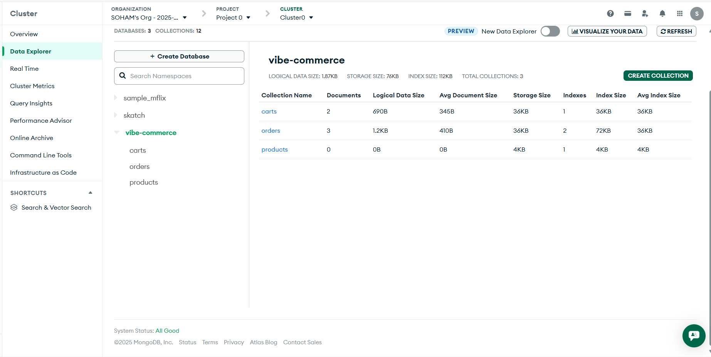
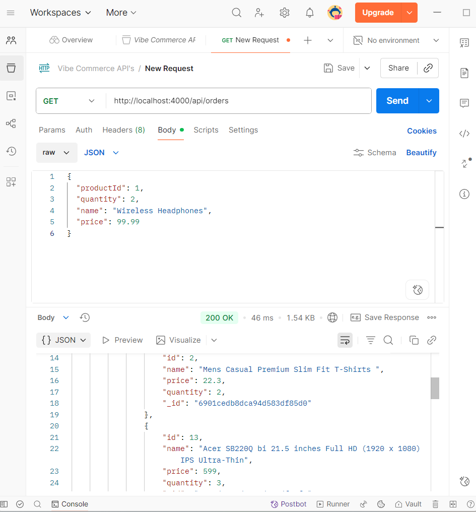
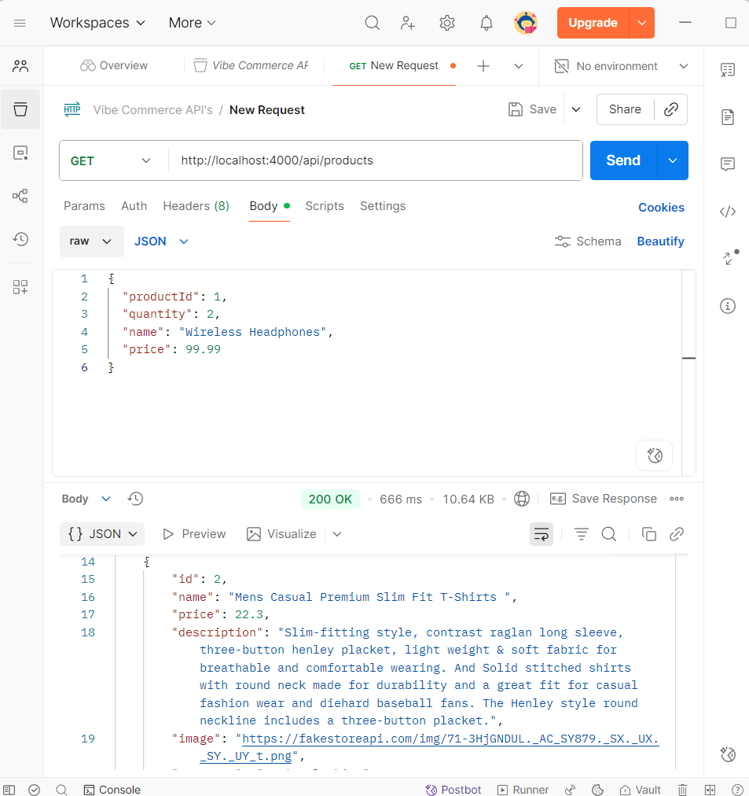
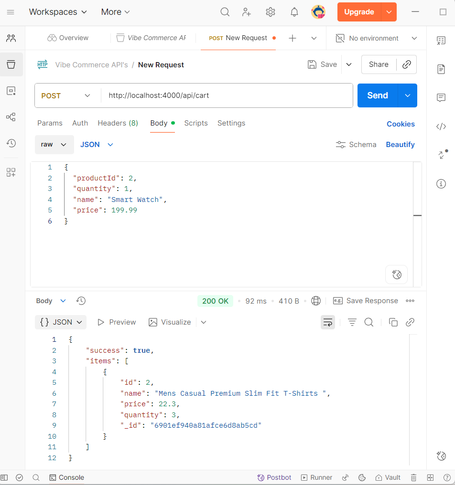
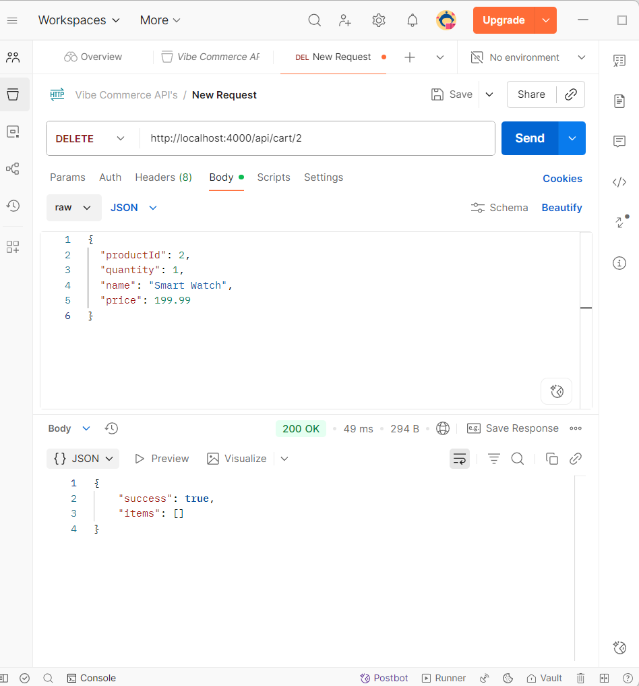
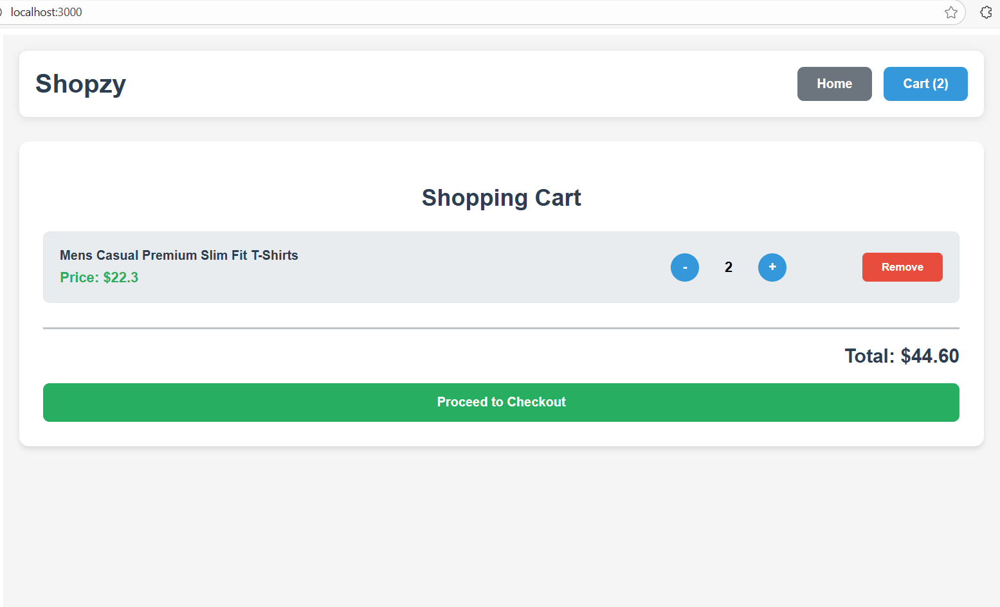
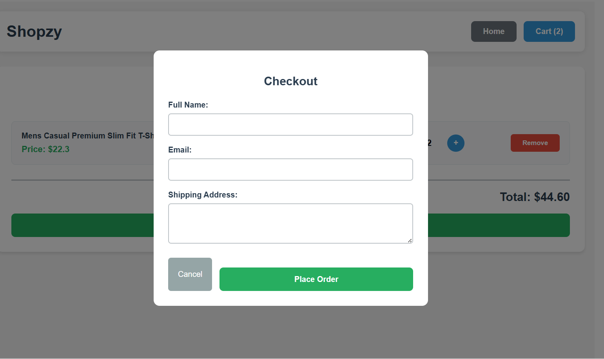

🛍️ E-Commerce Website

This is a full-stack e-commerce web application built using MERN (MongoDB, Express.js, React.js, Node.js). The project allows users to browse products, add items to cart, and place orders with an interactive UI and a secure backend API.

📁 Project Structure
ecommerce-website/
├── frontend/
│   ├── node_modules/
│   ├── public/
│   │   ├── index.html
│   │   └── logo.png
│   ├── src/
│   │   ├── components/
│   │   │   ├── Cart.js
│   │   │   ├── Checkout.js
│   │   │   ├── ProductCard.js
│   │   │   ├── ProductGrid.js
│   │   │   └── Receipt.js
│   │   ├── services/
│   │   │   └── api.js
│   │   ├── App.css
│   │   ├── App.js
│   │   ├── index.js
│   │   └── styles.css
│   ├── package-lock.json
│   └── package.json
├── backend/
│   ├── models/
│   │   ├── Cart.js
│   │   ├── Order.js
│   │   └── Product.js
│   ├── node_modules/
│   ├── routes/
│   │   ├── cartProducts.js
│   │   ├── cartRoutes.js
│   │   └── productRoutes.js
│   ├── .env
│   ├── db.js
│   ├── db.sqlite
│   ├── package-lock.json
│   ├── package.json
│   └── server.js

🚀 Features
🖥️ Frontend

Built with React.js

Responsive design using CSS / Bootstrap / Tailwind

Dynamic product listing and filtering

Add to cart and remove from cart functionality

User-friendly checkout flow

⚙️ Backend

Built with Node.js and Express.js

RESTful API for all CRUD operations

MongoDB database for product and user data

Authentication and authorization using JWT

Error handling and data validation using Mongoose

🧩 Tech Stack
Layer	    Technology Used
Frontend	React.js, HTML, CSS, Bootstrap/Tailwind
Backend	    Node.js, Express.js
Database	MongoDB (Atlas)
Tools	    Git, VS Code, Postman

⚡ Installation and Setup Instructions
1️⃣ Clone the repository
git clone https://github.com/soM1203/shopzy-ecommerce
cd ecommerce-website

2️⃣ Install dependencies
For frontend:
cd frontend
npm install

For backend:
cd backend
npm install

3️⃣ Setup environment variables

In the backend folder, create a .env file:

MONGO_URI=your_mongodb_connection_string
JWT_SECRET=your_secret_key
PORT=5000

4️⃣ Run the application
Run backend server:
cd backend
npm start

Run frontend:
cd frontend
npm start

Your app should now be running at http://localhost:3000

### MongoDB Collections

### Home Page

### Api Testing

### Cart

### Checkout

🧑‍💻 Author
Name: Soham Taru
Email: tarusoham031@gmail.com
Internshala Assignment: E-commerce Website Project
GitHub: https://github.com/som1203
Portfolio:https://soham-taru-portfolio.vercel.app/
